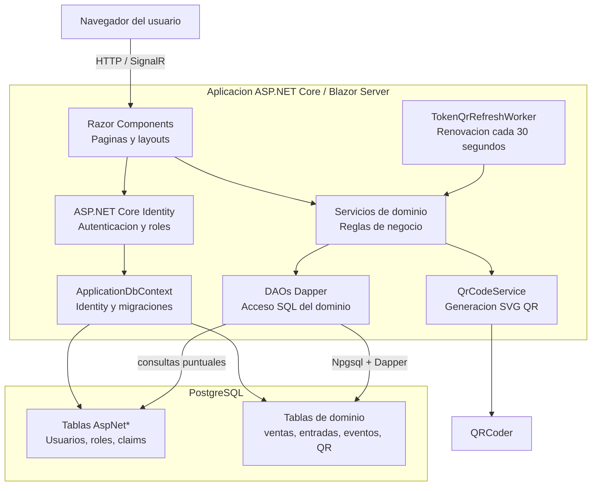
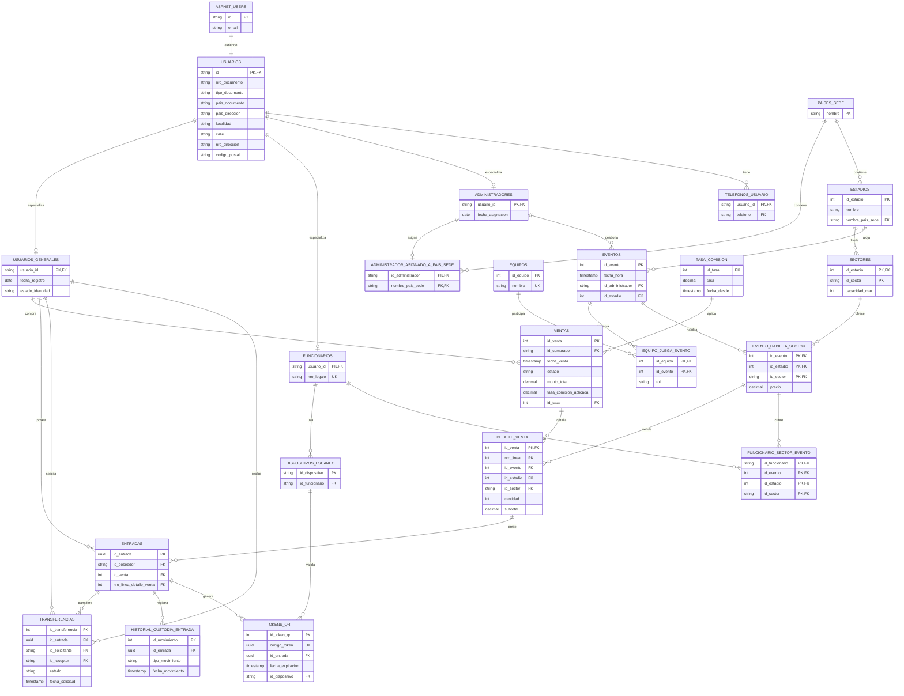
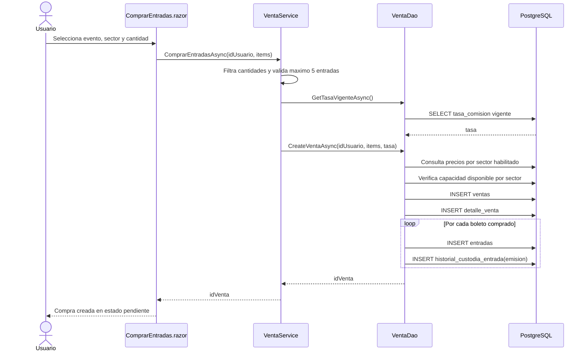
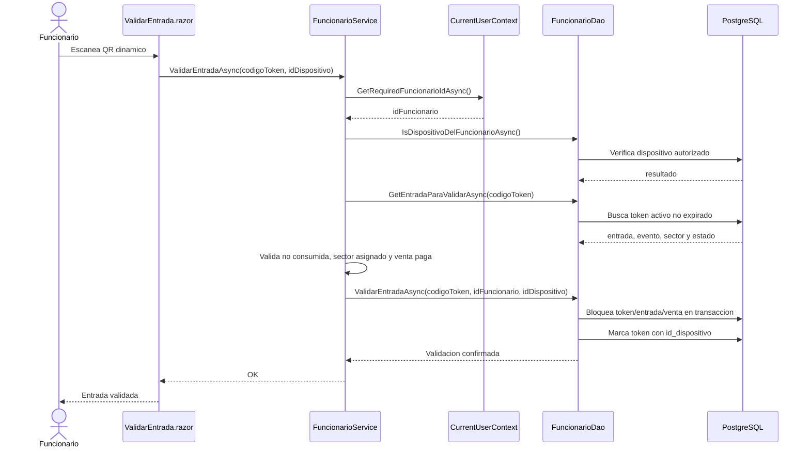
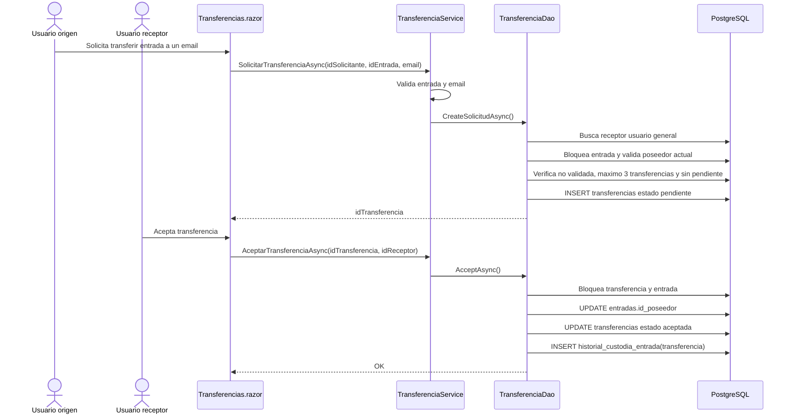

# Diagramas del sistema

Estos diagramas complementan el MER existente en
[`docs/diagrama-MER-obligatorio.drawio`](diagrama-MER-obligatorio.drawio) y
describen la arquitectura implementada en el proyecto.

## Diagrama de componentes

## Diagrama de clases y capas

```mermaid
classDiagram
    class IdentityUser
    class IdentityDbContext~ApplicationUser~
    class BackgroundService

    class ApplicationUser
    class ApplicationDbContext {
        #OnModelCreating(builder) void
    }
    class UserRegistrationService {
        +RegisterUserAsync(registrationData) IdentityResult
    }
    class AdministratorJurisdictionService {
        +GetHostCountriesAsync() IEnumerable~PaisSede~
        +GetCurrentCountryAsync() string
        +GetCurrentScopeAsync() AdministratorScope
        +ValidateRegistrationCountryAsync(role, countryName) IdentityResult
    }
    class EstadioService {
        +GetCurrentCountryAsync() string
        +GetAllEstadiosAsync() IEnumerable~Estadio~
        +GetSectoresByEstadioAsync(idEstadio) IEnumerable~Sector~
        +RegistrarEstadioAsync(nombre, sectores) void
        +ActualizarEstadioAsync(idEstadio, nombre, sectores) void
        +EliminarEstadioAsync(idEstadio) void
    }
    class EventoService {
        +GetCurrentCountryAsync() string
        +GetAllEquiposAsync() IEnumerable~Equipo~
        +GetAllEstadiosAsync() IEnumerable~Estadio~
        +GetSectoresByEstadioAsync(idEstadio) IEnumerable~Sector~
        +GetAllEventosDetalladosAsync() IEnumerable~EventoDetalle~
        +GetManagedEventosAsync() IEnumerable~EventoDetalle~
        +GetAllSectoresHabilitadosAsync() Dictionary
        +GetManagedSectoresHabilitadosAsync() Dictionary
        +AgregarEquipoAsync(nombre) void
        +ProgramarEventoAsync(fechaHora, idEstadio, idEquipoLocal, idEquipoVisitante, sectoresConPrecio) int
        +ActualizarEventoAsync(idEvento, fechaHora, idEstadio, idEquipoLocal, idEquipoVisitante, sectoresConPrecio) void
        +EliminarEventoAsync(idEvento) void
    }
    class VentaService {
        +GetTasaVigenteAsync() TasaComision
        +GetDisponibilidadAsync(idEvento, idEstadio) Dictionary
        +GetEntradasByUsuarioAsync(idUsuario) IEnumerable~EntradaDetalle~
        +GetAllVentasAsync() IEnumerable~VentaResumen~
        +GetVentasByUsuarioAsync(idUsuario) IEnumerable~VentaResumen~
        +GetDetallesByVentaAsync(idVenta) IEnumerable~EntradaDetalle~
        +ComprarEntradasAsync(idUsuario, items) int
        +ActualizarEstadoVentaAsync(idVenta, nuevoEstado) void
    }
    class TransferenciaService {
        +GetTransferenciasByUsuarioAsync(idUsuario) IEnumerable~TransferenciaDetalle~
        +GetPendientesRecibidasAsync(idUsuario) IEnumerable~TransferenciaDetalle~
        +GetCantidadTransferenciasEfectivasAsync(idsEntrada) Dictionary
        +SolicitarTransferenciaAsync(idSolicitante, idEntrada, emailReceptor) int
        +AceptarTransferenciaAsync(idTransferencia, idReceptor) void
        +RechazarTransferenciaAsync(idTransferencia, idReceptor) void
    }
    class FuncionarioService {
        +GetAllFuncionariosAsync() IEnumerable~FuncionarioInfo~
        +GetAllDispositivosAsync() IEnumerable~DispositivoAutorizado~
        +GetMisDispositivosAsync() IEnumerable~DispositivoAutorizado~
        +RegistrarDispositivoAsync(idDispositivo, idFuncionario) void
        +EliminarDispositivoAsync(idDispositivo) void
        +GetAllAsignacionesAsync() IEnumerable~AsignacionSector~
        +GetAsignacionesByEventoAsync(idEvento) IEnumerable~AsignacionSector~
        +GetMisAsignacionesAsync() IEnumerable~AsignacionSector~
        +AsignarSectorAsync(idFuncionario, idEvento, idEstadio, idSector) void
        +EliminarAsignacionAsync(idFuncionario, idEvento, idEstadio, idSector) void
        +ValidarEntradaAsync(codigoToken, idDispositivo) void
        +GetCoberturaSectoresAsync(idFuncionario, idEvento) IEnumerable~CoberturasSector~
    }
    class TokenQrService {
        +RenovarTokensActivosAsync() int
        +GetTokenActivoByEntradaAsync(idUsuario, idEntrada) TokenQrActivo
    }
    class TokenQrRefreshWorker {
        #ExecuteAsync(stoppingToken) void
    }
    class QrCodeService {
        +GenerateTokenQrDataUri(codigoToken) string
    }
    class QRCoder
    class CurrentUserContext {
        +GetRequiredAdministratorIdAsync() string
        +GetRequiredFuncionarioIdAsync() string
    }

    class IUserDao {
        <<interface>>
        +CreateAsync(identityUserId, nroDocumento, tipoDocumento, paisDocumento, paisDireccion, localidad, calle, nroDireccion, codigoPostal, role, paisSedeAsignado) void
    }
    class IUserPhoneDao {
        <<interface>>
        +AddAsync(userId, telefono) void
        +ReplaceAsync(userId, telefono) void
        +ReplaceAllAsync(userId, telefonos) void
        +GetByUserIdAsync(userId) IEnumerable~string~
        +DeleteAsync(userId, telefono) void
    }
    class IAdministratorJurisdictionDao {
        <<interface>>
        +GetHostCountriesAsync() IEnumerable~PaisSede~
        +CountryExistsAsync(countryName) bool
        +GetCountryForAdministratorAsync(administratorId) string
    }
    class IEstadioDao {
        <<interface>>
        +GetAllEstadiosAsync(nombrePaisSede) IEnumerable~Estadio~
        +GetSectoresByEstadioAsync(idEstadio, nombrePaisSede) IEnumerable~Sector~
        +BelongsToCountryAsync(idEstadio, nombrePaisSede) bool
        +CreateEstadioAsync(nombre, nombrePaisSede, sectores) int
        +UpdateEstadioAsync(idEstadio, nombre, nombrePaisSede, sectores) bool
        +DeleteEstadioAsync(idEstadio, nombrePaisSede) bool
    }
    class IEventoDao {
        <<interface>>
        +GetAllEquiposAsync() IEnumerable~Equipo~
        +CreateEquipoAsync(nombre) void
        +GetAllEventosDetalladosAsync() IEnumerable~EventoDetalle~
        +GetEventosDetalladosByCountryAsync(nombrePaisSede) IEnumerable~EventoDetalle~
        +GetAllSectoresHabilitadosAsync() Dictionary
        +GetSectoresHabilitadosByCountryAsync(nombrePaisSede) Dictionary
        +ExisteSuperposicionAsync(idEstadio, fechaHora, idEventoExcluir) bool
        +CreateEventoAsync(fechaHora, idAdministrador, idEstadio, idEquipoLocal, idEquipoVisitante, sectoresConPrecio) int
        +UpdateEventoAsync(idEvento, nombrePaisSede, fechaHora, idEstadio, idEquipoLocal, idEquipoVisitante, sectoresConPrecio) bool
        +DeleteEventoAsync(idEvento, nombrePaisSede) bool
    }
    class IVentaDao {
        <<interface>>
        +GetTasaVigenteAsync() TasaComision
        +CreateVentaAsync(idUsuario, items, tasa) int
        +GetAllVentasAsync() IEnumerable~VentaResumen~
        +GetVentasByUsuarioAsync(idUsuario) IEnumerable~VentaResumen~
        +GetDisponibilidadAsync(idEvento, idEstadio) Dictionary
        +UpdateEstadoVentaAsync(idVenta, estado) void
    }
    class IEntradaDao {
        <<interface>>
        +GetEntradasByUsuarioAsync(idUsuario) IEnumerable~EntradaDetalle~
        +GetDetallesByVentaAsync(idVenta) IEnumerable~EntradaDetalle~
    }
    class ITransferenciaDao {
        <<interface>>
        +CreateSolicitudAsync(idEntrada, idSolicitante, emailReceptor) int
        +GetTransferenciasByUsuarioAsync(idUsuario) IEnumerable~TransferenciaDetalle~
        +GetPendientesRecibidasAsync(idUsuario) IEnumerable~TransferenciaDetalle~
        +GetCantidadTransferenciasEfectivasAsync(idsEntrada) Dictionary
        +AcceptAsync(idTransferencia, idReceptor) void
        +RejectAsync(idTransferencia, idReceptor) void
    }
    class IFuncionarioDao {
        <<interface>>
        +GetAllFuncionariosAsync() IEnumerable~FuncionarioInfo~
        +GetAllDispositivosAsync() IEnumerable~DispositivoAutorizado~
        +GetDispositivosByFuncionarioAsync(idFuncionario) IEnumerable~DispositivoAutorizado~
        +IsDispositivoDelFuncionarioAsync(idDispositivo, idFuncionario) bool
        +CreateDispositivoAsync(idDispositivo, idFuncionario) void
        +DeleteDispositivoAsync(idDispositivo) bool
        +GetAllAsignacionesAsync() IEnumerable~AsignacionSector~
        +GetAsignacionesByEventoAsync(idEvento) IEnumerable~AsignacionSector~
        +GetAsignacionesByFuncionarioAsync(idFuncionario) IEnumerable~AsignacionSector~
        +ExisteAsignacionAsync(idFuncionario, idEvento, idEstadio, idSector) bool
        +CreateAsignacionAsync(idFuncionario, idEvento, idEstadio, idSector) void
        +DeleteAsignacionAsync(idFuncionario, idEvento, idEstadio, idSector) bool
        +GetEntradaParaValidarAsync(codigoToken) EntradaValidacionInfo
        +ValidarEntradaAsync(codigoToken, idFuncionario, idDispositivo) void
        +GetCoberturaSectoresAsync(idFuncionario, idEvento) IEnumerable~CoberturasSector~
    }
    class ITokenQrDao {
        <<interface>>
        +RenovarTokensActivosAsync() int
        +GetTokenActivoByEntradaAsync(idUsuario, idEntrada) TokenQrActivo
    }
    class ICurrentUserContext {
        <<interface>>
        +GetRequiredAdministratorIdAsync() string
        +GetRequiredFuncionarioIdAsync() string
    }

    class UserDao {
        +CreateAsync(identityUserId, nroDocumento, tipoDocumento, paisDocumento, paisDireccion, localidad, calle, nroDireccion, codigoPostal, role, paisSedeAsignado) void
    }
    class UserPhoneDao {
        +AddAsync(userId, telefono) void
        +ReplaceAsync(userId, telefono) void
        +ReplaceAllAsync(userId, telefonos) void
        +GetByUserIdAsync(userId) IEnumerable~string~
        +DeleteAsync(userId, telefono) void
    }
    class AdministratorJurisdictionDao {
        +GetHostCountriesAsync() IEnumerable~PaisSede~
        +CountryExistsAsync(countryName) bool
        +GetCountryForAdministratorAsync(administratorId) string
    }
    class EstadioDao {
        +GetAllEstadiosAsync(nombrePaisSede) IEnumerable~Estadio~
        +GetSectoresByEstadioAsync(idEstadio, nombrePaisSede) IEnumerable~Sector~
        +BelongsToCountryAsync(idEstadio, nombrePaisSede) bool
        +CreateEstadioAsync(nombre, nombrePaisSede, sectores) int
        +UpdateEstadioAsync(idEstadio, nombre, nombrePaisSede, sectores) bool
        +DeleteEstadioAsync(idEstadio, nombrePaisSede) bool
    }
    class EventoDao {
        +GetAllEquiposAsync() IEnumerable~Equipo~
        +CreateEquipoAsync(nombre) void
        +GetAllEventosDetalladosAsync() IEnumerable~EventoDetalle~
        +GetEventosDetalladosByCountryAsync(nombrePaisSede) IEnumerable~EventoDetalle~
        +GetAllSectoresHabilitadosAsync() Dictionary
        +GetSectoresHabilitadosByCountryAsync(nombrePaisSede) Dictionary
        +ExisteSuperposicionAsync(idEstadio, fechaHora, idEventoExcluir) bool
        +CreateEventoAsync(fechaHora, idAdministrador, idEstadio, idEquipoLocal, idEquipoVisitante, sectoresConPrecio) int
        +UpdateEventoAsync(idEvento, nombrePaisSede, fechaHora, idEstadio, idEquipoLocal, idEquipoVisitante, sectoresConPrecio) bool
        +DeleteEventoAsync(idEvento, nombrePaisSede) bool
    }
    class VentaDao {
        +GetTasaVigenteAsync() TasaComision
        +CreateVentaAsync(idUsuario, items, tasa) int
        +GetAllVentasAsync() IEnumerable~VentaResumen~
        +GetVentasByUsuarioAsync(idUsuario) IEnumerable~VentaResumen~
        +GetDisponibilidadAsync(idEvento, idEstadio) Dictionary
        +UpdateEstadoVentaAsync(idVenta, estado) void
    }
    class EntradaDao {
        +GetEntradasByUsuarioAsync(idUsuario) IEnumerable~EntradaDetalle~
        +GetDetallesByVentaAsync(idVenta) IEnumerable~EntradaDetalle~
    }
    class TransferenciaDao {
        +CreateSolicitudAsync(idEntrada, idSolicitante, emailReceptor) int
        +GetTransferenciasByUsuarioAsync(idUsuario) IEnumerable~TransferenciaDetalle~
        +GetPendientesRecibidasAsync(idUsuario) IEnumerable~TransferenciaDetalle~
        +GetCantidadTransferenciasEfectivasAsync(idsEntrada) Dictionary
        +AcceptAsync(idTransferencia, idReceptor) void
        +RejectAsync(idTransferencia, idReceptor) void
    }
    class FuncionarioDao {
        +GetAllFuncionariosAsync() IEnumerable~FuncionarioInfo~
        +GetAllDispositivosAsync() IEnumerable~DispositivoAutorizado~
        +GetDispositivosByFuncionarioAsync(idFuncionario) IEnumerable~DispositivoAutorizado~
        +IsDispositivoDelFuncionarioAsync(idDispositivo, idFuncionario) bool
        +CreateDispositivoAsync(idDispositivo, idFuncionario) void
        +DeleteDispositivoAsync(idDispositivo) bool
        +GetAllAsignacionesAsync() IEnumerable~AsignacionSector~
        +GetAsignacionesByEventoAsync(idEvento) IEnumerable~AsignacionSector~
        +GetAsignacionesByFuncionarioAsync(idFuncionario) IEnumerable~AsignacionSector~
        +ExisteAsignacionAsync(idFuncionario, idEvento, idEstadio, idSector) bool
        +CreateAsignacionAsync(idFuncionario, idEvento, idEstadio, idSector) void
        +DeleteAsignacionAsync(idFuncionario, idEvento, idEstadio, idSector) bool
        +GetEntradaParaValidarAsync(codigoToken) EntradaValidacionInfo
        +ValidarEntradaAsync(codigoToken, idFuncionario, idDispositivo) void
        +GetCoberturaSectoresAsync(idFuncionario, idEvento) IEnumerable~CoberturasSector~
    }
    class TokenQrDao {
        +RenovarTokensActivosAsync() int
        +GetTokenActivoByEntradaAsync(idUsuario, idEntrada) TokenQrActivo
    }

    %% Herencias del framework
    IdentityUser <|-- ApplicationUser
    IdentityDbContext~ApplicationUser~ <|-- ApplicationDbContext
    BackgroundService <|-- TokenQrRefreshWorker

    %% ApplicationDbContext gestiona ApplicationUser
    ApplicationDbContext --> ApplicationUser

    %% Services -> Interfaces (dependencias)
    UserRegistrationService --> IUserDao
    UserRegistrationService --> IUserPhoneDao
    UserRegistrationService --> AdministratorJurisdictionService
    AdministratorJurisdictionService --> IAdministratorJurisdictionDao
    AdministratorJurisdictionService --> ICurrentUserContext
    EstadioService --> IEstadioDao
    EstadioService --> AdministratorJurisdictionService
    EventoService --> IEventoDao
    EventoService --> IEstadioDao
    EventoService --> AdministratorJurisdictionService
    VentaService --> IVentaDao
    VentaService --> IEntradaDao
    TransferenciaService --> ITransferenciaDao
    FuncionarioService --> IFuncionarioDao
    FuncionarioService --> ICurrentUserContext
    TokenQrService --> ITokenQrDao
    TokenQrRefreshWorker --> TokenQrService
    QrCodeService ..> QRCoder

    %% Interfaces <|.. Implementaciones
    IUserDao <|.. UserDao
    IUserPhoneDao <|.. UserPhoneDao
    IAdministratorJurisdictionDao <|.. AdministratorJurisdictionDao
    IEstadioDao <|.. EstadioDao
    IEventoDao <|.. EventoDao
    IVentaDao <|.. VentaDao
    IEntradaDao <|.. EntradaDao
    ITransferenciaDao <|.. TransferenciaDao
    IFuncionarioDao <|.. FuncionarioDao
    ITokenQrDao <|.. TokenQrDao
    ICurrentUserContext <|.. CurrentUserContext
```

## Diagrama entidad-relacion implementado

## Secuencia de compra de entradas

## Secuencia de validacion de entrada QR

## Secuencia de transferencia de entrada

## Notas para el informe

- El MER editable esta en `docs/diagrama-MER-obligatorio.drawio`.
- El diagrama entidad-relacion anterior refleja las tablas creadas por la
  migracion `20260621201820_InitialSchema`.
- El diagrama de clases prioriza servicios, interfaces y DAOs porque esas son
  las clases propias donde se concentran las reglas del obligatorio.
- Los diagramas de secuencia documentan los casos de uso con mas reglas de
  integridad: compra, validacion QR y transferencia.
